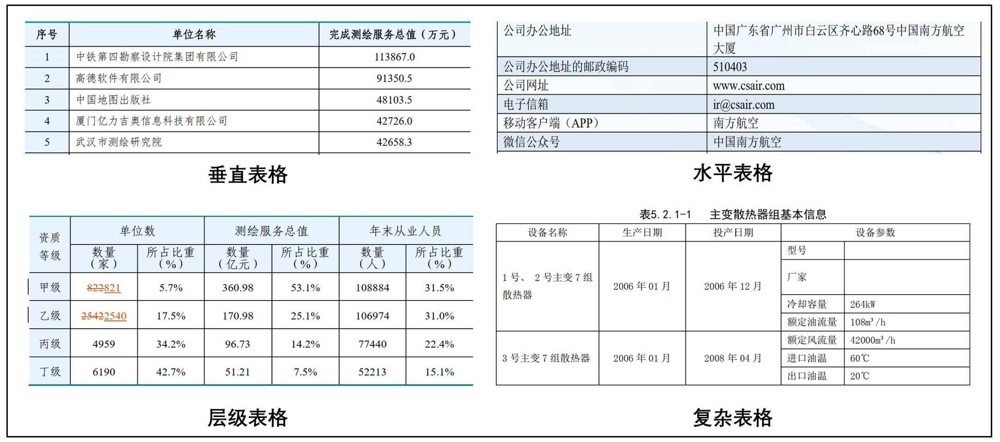
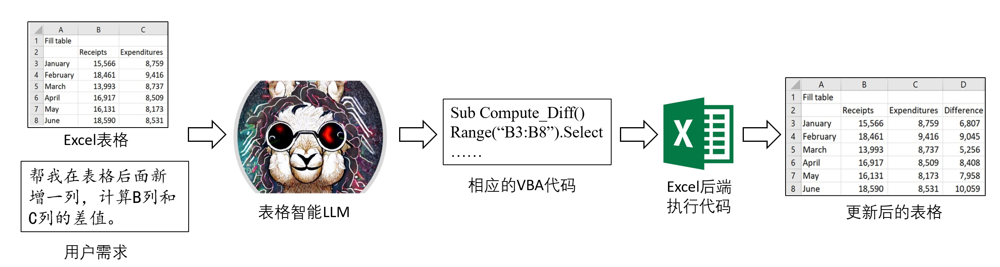

## 0. 背景

以ChatGPT为代表的LLMs对NLP研究领域产生了巨大的冲击，表格智能研究方向也是如此。对ChatGPT等模型处理表格的能力进行初步调研，其至少支持以下表格智能任务：

- (1) **表格绘制**
- (2) **表格修改**
- (3) **表格问答**
- (4) **文本-表格制作**：基于一段文本，制作表格展示文本中的信息
- (5) **表格事实验证**：用户给出一个陈述语句，验证表格内容对于该语句是支持、否定还是不相关。
- (6) **表格-文本生成**

## 1. ChatGPT等模型在表格处理的一些局限
- **主要支持用Markdown格式表示的简单表格**：对于其他类型表格的支持相对较弱，尤其是包含合并单元格的表格。
- **在各项表格智能任务中的能力有待进一步增强**：在回答复杂的数值推理类问题（基于表格中的数值进行多步数学计算）时经常出错。
- **与表格处理相关的训练数据并未开源**：ChatGPT的训练数据并未开源。为了复现ChatGPT，开源社区目前也已经贡献了许多纯文本任务的宝贵训练数据，但表格智能任务的训练数据相对较少，缺乏统一的整理。

## 2. 表格的表示方法
**我们应该采用什么方法来表示表格，才能更有利于模型的理解？**

### 2.1 不同类型的表格

### 2.2 启发式文本序列格式

和常见的预训练模型一样，学界现有的表格预训练模型同样可以分为**判别式模型**和**生成式模型**。

判别式表格预训练模型采用类似BERT的结构（Encoder），典型模型包括[TAPAS](https://arxiv.org/abs/2004.02349)、[TableFormer](https://arxiv.org/abs/2203.00274)、[TABERT](https://arxiv.org/abs/2005.08314)等，它们的目标是**学习到好的表格表示来支持下游任务**，包括单元格表示向量、列表示向量等。

生成式表格预训练模型采用类似BART、T5的结构（Encoder-Decoder），典型模型为[TAPEX](https://arxiv.org/abs/2107.07653)。它们的目标是**采用Seq2Seq的方式直接完成下游任务**，比如直接回答关于表格的问题。

### 2.3 Markdown格式
使用 “|” 来分隔不同的单元格，使用 “-” 来分隔表头所在的第一行和其他行，如下所示。

更适合表示结构较为简单的垂直表格或水平表格，无法很好地表示更复杂的表格结构，比如可能包含合并单元格的层级表格和复杂表格。

### 2.4 HTML格式

为了表示更复杂的表格结构，尤其是合并单元格，我们可以使用HTML格式来表示表格，除了能表示合并单元格，HTML还可以设定单元格对齐、单元格背景颜色等表格样式。

### 2.5 Latex格式

在写论文时也会用Latex代码来表示表格，同样可以支持合并单元格，文本对齐等格式，如下所示：

### 2.6 小结

需要注意的是，选择哪种表格表示方法可能还需要考虑底座LLM的代码能力和具体的应用场景。
    
例如对于Excel表格,表格智能LLM就需要理解Excel表格并生成VBA代码，最终执行代码返回更新后的表格。整体流程可能如下所示：

## 3.目前已有工作

### 3.0 表格识别解析（图像→文本生成）
| 模型 | 数据集 | 简介 | 
| --- | --- | --- | 
| [Unitable](https://github.com/poloclub/unitable?tab=readme-ov-file) | 在1M和2M的表格图像上预先训练VQ-VAE。1M在PubTabNet和SynthTabNet上进行训练，用于训练2M的额外1M个数据集是Pub VQ-1M和TableBank。| UniTable是一种用于表格识别的统一框架，主要方法如下： **1.视觉编码器的自监督预训练（SSP）** (1)**图像标记化**  (2)**图像分块与掩码**   **2.统一微调框架** 将任务统一表示：输入仅为原始像素形式的图像，输出为标记序列形式的文本，适用于 PDF 输入（可截图转换），且能利用未标注表格图像预训练的视觉编码器。|   |

### 3.1 表格问答

| 数据集 | 会议 | 样本数量 | 简介 | 语言 | 论文 | huggingface地址 | 备注 | 更新时间 |
| --- | --- | --- | ------------ | :---: | --- | --- |---| --- |
| [TAT-QA](https://nextplusplus.github.io/TAT-QA/) | ACL 2021 | 训练集：14883，测试集：1669 | 需要同时考虑表格和文本信息进行多跳推理，很多样本需要进行数值计算以得到最终答案。数据来自于公司的经济年报。| 英文 | TAT-QA: A Question Answering Benchmark on a Hybrid of Tabular and Textual Content in Finance | [Markdown格式](https://huggingface.co/datasets/SpursgoZmy/IFT-Data-For-Tabular-Tasks/tree/main/TAT-QA) | 将问题、扁平化表格和相关段落依次输入基于 Transformer 的编码器，从混合上下文中提取回答问题所需的证据，并针对表格数据计算设计各项分类器完成任务。|   |

### 3.2 表格事实验证

### 3.3 表格→文本生成

### 3.4 表格基础结构理解

### 3.5 文本→表格绘制

### 3.6 比较综合的模型
| 数据集 | 样本数量 | 简介 | 语言 | huggingface地址 | 备注 | 更新时间  |
| --- | --- | --- | --- | --- | --- | --- |
| [MMTab](https://huggingface.co/datasets/SpursgoZmy/MMTab/tree/main) | 预训练150K，微调232K| 精心设计脚本，将这些数据集中的原始文本表转换为表格图像，突出了表格结构和样式的广泛覆盖范围，并将所有特定于任务的样本转换为具有统一格式的多模态指令调整样本。生成的数据集包含三个部分。在数据集中采用多层次（如表级、任务级）的数据增强，进一步提高数据多样性。<table image, input request, output response> | 英文 | [图像+json描述格式](https://huggingface.co/datasets/SpursgoZmy/MMTab/tree/main)  | Table-Llava模型： 预训练ViT将输入图像编码为视觉特征; 两层MLP作为视觉语言连接器，将视觉特征投影到LLM的词嵌入空间。Vicuna模型作为骨干 LLM，接收处理后的视觉特征和嵌入的文本特征连接作为输入，生成最终响应。 |   |

## 4. 现有的表格智能产品
一些国内外已有的表格智能产品
| 产品 | 团队/公司 | 推出时间 | 介绍 | 优缺点 |
| --- | --- | --- | --- | --- |
| [TableAgent](https://tableagent.datacanvas.com/) | 九章云极 | 2023年 | 基于DataCanvas Alaya九章元识大模型构建的数据分析智能体，支持用户上传csv表格进行数据分析、问答等。 | 尚未试用  |
| [Tableau AI](https://www.tableau.com/products/tableau-ai) | Tableau (Salesforce) | 2023年 | 作为代表性商业智能软件，Tableau也推出了生成式AI加持的BI（Business Intelligence）助手，可以自动分析、描述、解读用户数据。 | 尚未试用  |
| [ChatExcel](https://chatexcel.com/) | 北大 | 2023年2月 | 一个能够便捷人对 Excel 复杂操作的智能助手，用户上传Excel表格，然后用自然语言描述自己的需求，比如“求每行数据的平均值作为新增的一列”，ChatExcel可以对表格进行自动处理，返回更新后的表格以满足用户需求。更多信息可以参考项目核心成员撰写的[知乎回答](https://www.zhihu.com/question/586673687/answer/2914537074)。| 对复杂需求的语义理解有待增强，不知道背后有没有接大模型hhh，目前似乎只支持最简单的垂直表格，无法处理合并单元格。 |
| [Microsoft 365 Copilot](https://www.microsoft.com/en-us/microsoft-365/blog/2023/03/16/introducing-microsoft-365-copilot-a-whole-new-way-to-work/) | 微软 | 2023年3月16日 | Excel上，Copilot可以与用户进行自然语言的交互，帮助用户分析表格数据并自动创建可视化图表，甚至是创建新的工作表，比如可以向Copilot提出需求“分析本季度的销售状况并总结3个关键业务趋势”，“详细展示某个客户的销售业绩情况”。更多信息可以参考[知乎话题](https://www.zhihu.com/question/590269908/answer/2948688426?utm_id=0)。 | 如果说ChatExcel针对是Excel的基本函数操作，Copilot in Excel看上去希望更进一步，承担更高阶的分析能力，就像有个助手帮你分析Excel表格，画出精美的图表。不过官方的演示示例使用的也是标准的垂直表格，不知道对于更复杂表格的支持情况如何。 |

